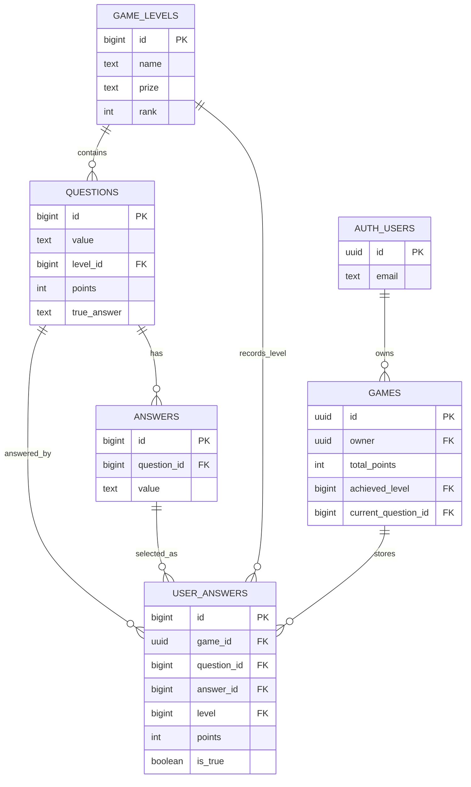

# Nexus Game

Nexus Game is a browser-based quiz and trivia game inspired by the "Who Wants to Be a Millionaire" format. Players sign in with Supabase Auth, play through question ladders, track game sessions, and customize a profile with a nickname and avatar.

## Project Description

This repository contains a single-page application for playing the game, managing user identity, and storing gameplay data in Supabase.

Players can:

- Sign in and register with Supabase Auth.
- Play and track game sessions.
- View dashboards and game history pages.
- Update a profile nickname and upload an avatar.

The app is designed for authenticated users, with RLS policies protecting user-owned data and public read access for quiz content.

## Architecture

### Front End

The UI is a Vite-powered SPA built with HTML, CSS, JavaScript, and Bootstrap 5.

- `src/main.js` bootstraps the app, renders the active route, and attaches page listeners.
- `src/router.js` maps URLs to page renderers.
- `src/layout/app-layout.js` wraps each page with the shared header and footer.
- `src/pages/` contains page-level views such as home, login, dashboard, games, game play, and profile.
- `src/components/` contains reusable UI pieces like the header and footer.
- `src/styles/global.css` defines the shared theme, layout, and utility styling.

### Back End

Supabase provides the server-side services:

- Auth for sign-up, sign-in, and current-user state.
- Postgres for game sessions, questions, answers, and progress tracking.
- Storage for avatar uploads.
- Row Level Security for user ownership and read-only content rules.

### Technologies Used

- Vite
- JavaScript (ES modules)
- Bootstrap 5
- Supabase JS client
- Supabase Postgres
- Supabase Auth
- Supabase Storage

## Database Schema Design

The current game schema centers on a ladder of difficulty levels, questions, answers, and per-user game records.



### Main Tables

- `public.game_levels` stores the prize ladder and level ordering.
- `public.questions` stores quiz prompts and their level association.
- `public.answers` stores answer options for each question.
- `public.games` stores active and completed game sessions for a user.
- `public.user_answers` stores each submitted answer and score result.

### Related Data

- Supabase Auth users are stored in `auth.users`.
- Profile metadata is stored in auth user metadata as `nickname` and `avatar_url`.
- Avatar files are stored in the public `avatars` bucket.

## Local Development Setup

### Prerequisites

- Node.js
- npm
- A Supabase project

### 1. Install dependencies

```bash
npm install
```

### 2. Configure environment variables

Create a `.env.local` file in the project root:

```bash
VITE_SUPABASE_URL=your-supabase-project-url
VITE_SUPABASE_ANON_KEY=your-supabase-anon-key
```

### 3. Apply the Supabase migrations

Run the SQL migrations in `supabase/migrations/` against your Supabase project.

Recommended order:

1. Initial schema and game tables.
2. RLS policy migrations.
3. Seed question and answer migrations.
4. Avatar storage migration.

### 4. Seed the database

```bash
npm run db:seed
```

### 5. Start the local app

```bash
npm run dev
```

### 6. Build for production

```bash
npm run build
```

## Key Folders and Files

- `src/main.js` - App bootstrap and route-based listener wiring.
- `src/router.js` - Client-side route definitions.
- `src/layout/app-layout.js` - Shared shell around the page content.
- `src/components/header/` - Navigation header and auth-aware actions.
- `src/components/footer/` - Shared footer markup.
- `src/pages/home/` - Landing page.
- `src/pages/login/` - Authentication UI.
- `src/pages/dashboard/` - Dashboard overview.
- `src/pages/games/` - Game list page.
- `src/pages/game-detail/` - Game detail page.
- `src/pages/game-start/` - New game flow.
- `src/pages/game-play/` - Active gameplay screen.
- `src/pages/profile/` - Nickname and avatar profile page.
- `src/services/supabase-client.js` - Supabase client and auth helpers.
- `src/services/auth.js` - Login, register, and logout helpers.
- `src/services/games.js` - Game session and question helpers.
- `src/services/profile.js` - Profile metadata and avatar upload helpers.
- `src/styles/global.css` - Shared visual system and theme variables.
- `supabase/migrations/` - Database, RLS, and storage migrations.
- `scripts/seed.js` - Database seeding script.
- `docs/` - Supporting documentation for schema and seeding.

## Development Notes

- The app uses SPA navigation, so links should include `data-link` when they are meant to be handled client-side.
- Game data is fetched from Supabase in service modules rather than directly inside page renderers.
- Avatar uploads are cropped client-side before upload and limited to 500KB after processing.
- Public read access is intended for quiz content, while user-owned records remain protected by RLS.
- Admin access is controlled through `public.profiles.role`; set a user to `admin` in Supabase before using the admin page.

## Related Documentation

- [Required database schema](docs/required_db_schema.md)
- [RLS implementation summary](docs/rls_implementation_summary.md)
- [Seeding guide](docs/seeding_guide.md)
